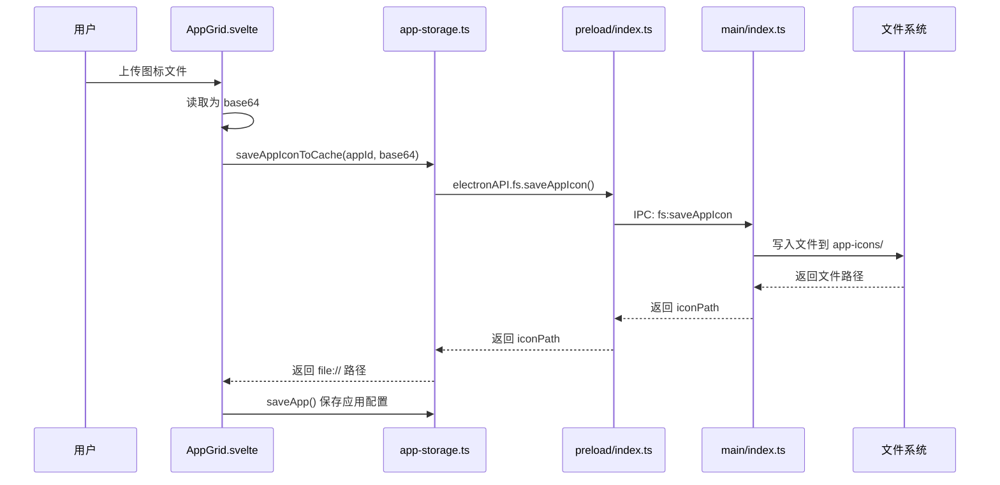

# 应用图标缓存机制

## 问题背景

用户手动添加应用时上传的图标文件，如果只是转换为 base64 存储在 localStorage 中，存在以下问题：
1. localStorage 有大小限制（通常 5-10MB）
2. 大量 base64 数据会影响性能
3. 用户删除原始图标文件后，应用图标会丢失

## 解决方案

实现了应用图标本地缓存机制，将用户上传的图标保存到 Electron 的 userData 目录中。

## 实现细节

### 1. 存储位置

图标文件保存在：
```
{userData}/app-icons/{appId}.{imageType}
```

例如：
```
~/Library/Application Support/奇易聚合浏览AI+/app-icons/app_1234567890.png
```

### 2. 工作流程



### 3. 代码实现

#### 3.1 主进程 IPC 处理器 (`main/index.ts`)

```typescript
ipcMain.handle('fs:saveAppIcon', async (_, { appId, base64Data }) => {
  try {
    const userDataPath = app.getPath('userData');
    const iconsDir = join(userDataPath, 'app-icons');
    
    // 确保图标目录存在
    if (!existsSync(iconsDir)) {
      await mkdir(iconsDir, { recursive: true });
    }
    
    // 解析 base64 数据
    const matches = base64Data.match(/^data:image\/(\w+);base64,(.+)$/);
    if (!matches) {
      throw new Error('无效的 base64 图片数据');
    }
    
    const imageType = matches[1];
    const base64Content = matches[2];
    const buffer = Buffer.from(base64Content, 'base64');
    
    // 生成图标文件名
    const iconFileName = `${appId}.${imageType}`;
    const iconPath = join(iconsDir, iconFileName);
    
    // 保存文件
    await writeFile(iconPath, buffer);
    
    return { success: true, iconPath };
  } catch (error: any) {
    return { success: false, error: error.message };
  }
});
```

#### 3.2 Preload 桥接 (`preload/index.ts`)

```typescript
fs: {
  // ... 其他方法
  saveAppIcon: (appId: string, base64Data: string) =>
    ipcRenderer.invoke('fs:saveAppIcon', { appId, base64Data }),
}
```

#### 3.3 存储工具 (`utils/app-storage.ts`)

```typescript
export async function saveAppIconToCache(appId: string, base64Data: string): Promise<string> {
  try {
    // 如果不是 base64 数据（可能是已有的路径），直接返回
    if (!base64Data.startsWith('data:image/')) {
      return base64Data;
    }

    const result = await window.electronAPI.fs.saveAppIcon(appId, base64Data);
    
    if (result.success && result.iconPath) {
      // 返回本地文件路径，使用 file:// 协议
      return `file://${result.iconPath}`;
    } else {
      // 如果保存失败，返回原始 base64 数据作为备选
      return base64Data;
    }
  } catch (error) {
    // 如果出错，返回原始 base64 数据
    return base64Data;
  }
}
```

#### 3.4 UI 组件使用 (`AppGrid.svelte`)

```typescript
async function handleSaveApp() {
  // ... 验证表单

  // 如果有新的图标（base64 数据），先保存到本地缓存
  let iconPath = formData.icon || './apps/icons/x.svg';
  if (formData.icon && formData.icon.startsWith('data:image/')) {
    iconPath = await saveAppIconToCache(formData.id, formData.icon);
  }

  const appToSave: AppConfig = {
    // ...
    icon: iconPath, // 使用缓存后的路径
  };

  saveApp(appToSave);
}
```

### 4. 数据格式

#### 保存前（localStorage 中）
```json
{
  "id": "app_1234567890",
  "name": "我的应用",
  "icon": "data:image/png;base64,iVBORw0KGgoAAAANS..."
}
```

#### 保存后（localStorage 中）
```json
{
  "id": "app_1234567890",
  "name": "我的应用",
  "icon": "file:///Users/xxx/Library/Application Support/奇易聚合浏览AI+/app-icons/app_1234567890.png"
}
```

## 优势

1. **持久化存储**: 图标文件独立存储，不受 localStorage 限制
2. **性能优化**: 不在 localStorage 中存储大量 base64 数据
3. **容错机制**: 如果保存失败，会回退到 base64 数据
4. **自动管理**: 图标文件与应用 ID 关联，便于管理和清理

## 兼容性

- 支持的图标格式：PNG, JPG, GIF, BMP, WebP, SVG, ICO
- 内置应用的图标仍使用相对路径（`./apps/icons/xxx.svg`）
- 用户上传的图标使用 `file://` 协议的绝对路径

## 清理机制

当删除应用时，可以考虑同步删除对应的图标文件（待实现）：

```typescript
export function deleteApp(appId: string): void {
  try {
    const app = getAppById(appId);
    if (app && app.icon.startsWith('file://')) {
      // 可选：删除图标文件
      // await window.electronAPI.fs.deleteFile(app.icon)
    }
    
    const apps = getAllApps();
    const filtered = apps.filter(a => a.id !== appId);
    localStorage.setItem(STORAGE_KEY, JSON.stringify(filtered));
  } catch (error) {
    console.error('删除应用配置失败:', error);
    throw error;
  }
}
```

## 测试验证

1. 创建新应用并上传图标
2. 检查 userData/app-icons 目录是否生成了图标文件
3. 删除原始图标文件
4. 重启应用，验证图标是否正常显示
5. 检查 localStorage 中存储的是 file:// 路径而不是 base64

## 注意事项

1. 图标文件命名使用应用 ID，确保唯一性
2. 如果同一应用多次上传图标，会覆盖旧文件
3. 图标文件不会自动清理，需要手动实现清理逻辑
4. 使用 `file://` 协议加载本地图标，确保浏览器安全策略允许

